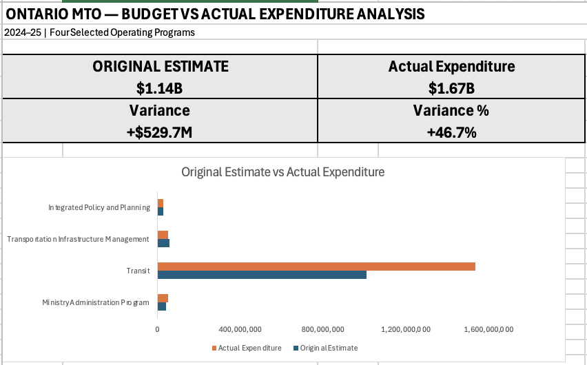

# Ontario Ministry of Transportation Budget vs Actual Analysis

## Project Overview
This independent project analyzes publicly available Government of Ontario expenditure data for four selected Ontario Ministry of Transportation operating programs.

The objective was to compare 2024–25 original expenditure estimates with actual expenditures, calculate dollar and percentage variances, and present the results in a clear Excel dashboard.

## Tools Used
- Microsoft Excel
- Excel formulas
- Budget vs Actual Analysis
- Variance Analysis
- Dashboard Development

## Key Results
- **Original Estimate:** approximately $1.14B
- **Actual Expenditure:** approximately $1.67B
- **Aggregate Variance:** approximately +$529.7M
- **Aggregate Variance %:** approximately +46.7%

Transit represented the largest variance among the four selected programs, with actual expenditure approximately **$528.0M above the original estimate**, or approximately **52.3%**.

The analysis compares actual expenditure with the original estimate and should not be interpreted as an assessment of final authorized spending.

## Dashboard

## Excel Workbook

[View / Download the Excel Analysis](Mahadi_Alam_MTO_Financial_Analysis.xlsx)

## Data Sources

## Data Sources

- [Government of Ontario — Ministry of Transportation 2024–25 Expenditure Estimates](https://www.ontario.ca/page/expenditure-estimates-ministry-transportation-2024-25)
- [Government of Ontario — Ministry of Transportation 2026–27 Expenditure Estimates](https://www.ontario.ca/page/expenditure-estimates-ministry-transportation-2026-2027)
- [Public Accounts of Ontario 2024–25 — Ministry Statements and Schedules](https://www.ontario.ca/page/public-accounts-2024-25-ministry-statements-and-schedules)

## Scope
This analysis covers four selected Ministry of Transportation operating programs and does not represent a complete analysis of total ministry expenditure.

This project was independently created for portfolio and educational purposes using publicly available Government of Ontario data.
